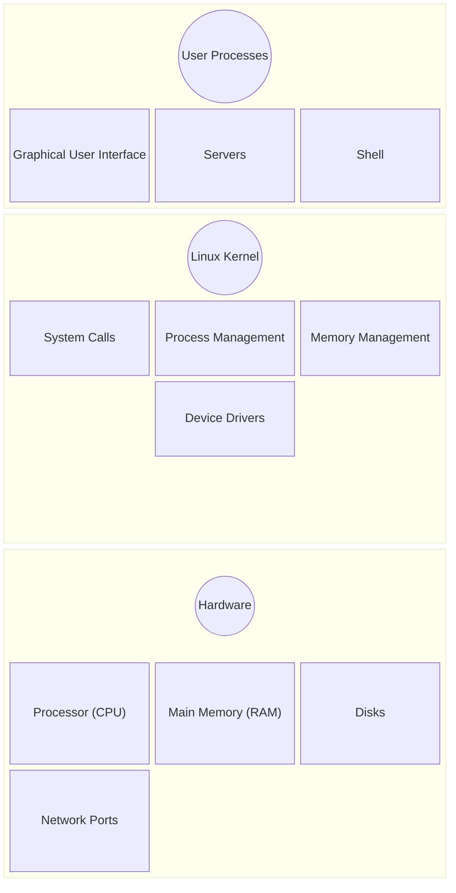

# The big  picture

## I - Introduction
while the internals of the linux operating system, or operating systems overall appear to be so complexe, users interact with such powerful systems through layers that simplify this interaction, called : abstraction, based on one's needs a user can go as deep as needed when interacting with components of an operating system without needing to know the intricacies and under the hood of other tools making it a lot more manageable.

# II - Layers of abstraction in a linux system  

*   Figure 1-1: General Linux system organization

