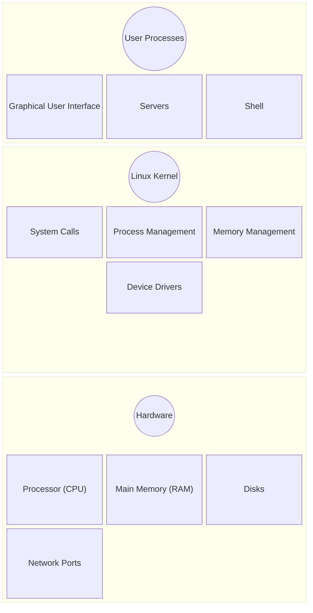
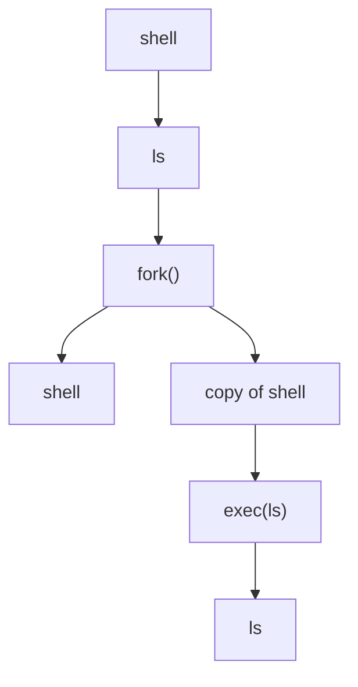

# The big  picture

## I - Introduction
while the internals of the linux operating system, or operating systems overall appear to be so complexe, users interact with such powerful systems through layers that simplify this interaction, called : abstraction, based on one's needs a user can go as deep as needed when interacting with components of an operating system without needing to know the intricacies and under the hood of other tools making it a lot more manageable.

# II - Layers of abstraction in a linux system  

*   Figure 1-1: General Linux system organization

the user processes run differently than the kernel, user processes are often run in user mode, and often have restricted access to memory, while the kernel runs on what's called the kernel space, and is in charge of managing hardware and memory, but also the software hardware iterface, crashes in kernel space often cause very dangerous consequences, while use processes due to retricted access cause relatively less dagame at crash, the kernel is in charge for preventing such catastrophies form the user programs, but it remains highly dependant on the process and the accesses allowed for it.

## III - Understanding main memory
the main memory is the part of the computer reponsible for storing data and state, at its rawest form it's just a collection of 0s and 1s and the processor acts as an operator on memory, it reads the data operates on it and updates state, while it would be hard to differentiate the data from state as they both refer to a collection of bits, and state is in some way a sort of data, we often abstract away the raw terms, and state shifts into these functional domains :  
1. **Context**: State becomes the snapshot of the process at a specific time.

2. **Topology**: State represents the graph of the application (pointers, object references, and data structures).

3. **Intent**: State is the configuration that tells the "operator" (CPU) what to do next.

## IV - The Kernel
_so why are we talking about state and main memory ?_  
Well, it is the Kernel's job to manage the main memory, how it's subdivised and keeping track of the state of each of these subdivisions.
Generally the Kernel is in charge of managing those tasks in four areas : 
- Processes : Managing which processes are allowed to occupy the CPU at which time.
- Memory : Managing which parts of the memory are free, which are allocated, which could be requested for allocation, and which are shared between processes.
- Device drivers : The kernel acts the software-hardware interface, it's the Kernel's job to operate the hardware.
- System calls and support : processes are able to communicate with the Kernel via system calls.

### 1 - Process Management
Process management refers to the starting, pausing, resuming, scheduling and terminating of the processes. While it might appear that multiple processes run all at the same time, from a logical standpoint one might argue that only one process can occupy the CPU at a given instance, which is true, ***so how does the CPU run multiple processes and switch between them ?*** 
each processs occupies the CPU for a slice of time, this period is called the *time slice*, after this periods ends the process hands back control to the CPU which then gets occupied by the next process, this switching between processes is called *context swtich*. The detailed steps are illustrated bellow : 

1. The CPU drops the current process based on the internal timer and hands back control to the Kernel.
2. The Kernel takes a screenshot of the current state of the CPU and memory, essential for resuming in the future.
3. The kernel starts executing the I/O operations and any other hanging processes that were triggered during the time slice.
4. The Kernel is ready to chose another process to run, it runs into the list of processes available and choses one.
5. The Kernel prepares the CPU and memory for the new process.
6. The kernel sets the internal time slice on the CPU.
7. The process is now ready to run, the Kernel switches the CPU into user mode.

while this single core approach doesn't account for modern multi-core CPUs, where the Kernel doesn't need to stop the process but just delegate it into some other core, the reality is a little more nuanced and the Kernel still allocates some time windows for itself to maximize CPU usage, similarly to what we've shown here.
### 2 - Memory Management
Managing memory on context switches is indeed a very complexe task. Nonetheless, it should generally simply just answer to the following conditions : 
*   the kernel should have its own private area in memory that user processes can't access. 
*   The system should be able to allocate more memory than is currently available in the main memory using auxiliary memroy from the disk.
*   Processes can share memory.
*   Some memory in user processes can be read-only.
*   Each process needs its own section of memory.
*   A process shall not access the private memory of another process.

Fortunately, the kernel has help from the CPU, which features a dedicated *Memory Management Unit (MMU)*. This unit allows processes to interact with memory as if they have the entire address space to themselves by using virtual memory, which the MMU then maps to the appropriate physical addresses. The data structure used for this mapping is called a page table. However, the kernel must intervene during a context switch to update the MMU to point to the new process's page table.
### 3 - Device drivers
The kernel prevents user processes from accessing hardware directly, which protects system stability. Instead, device drivers provide a unified interface, abstracting the underlying hardware complexity and allowing the kernel to interact with various devices through a consistent set of commands.
### 4 - system calls and support
One more kernel feature that is provided to user processes is system calls, which allows them to communitcate with the kernel, one classic example is for shell commands, everytime a command like ls executes a fork() system call is made which creates a copy of the current shell in which the exec(ls) system call that executes the new command in a different process.

the kernel also supports user processes with features other than 